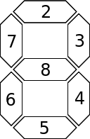

# LED Trial Shield, Oranje Band

## Doel

Laat het zeven segmenten display tellen van nul tot en met negen. 
Elk getal moet een seconde zichtbaar zijn.

Als dit gelukt is, gaat de piezo piepen.

## Pinnnummers

De pinnen zijn zoals in het plaatje:
 * Bovenste: 2
 * Rechterzijkant, bovenste: 3
 * Rechterzijkant, onderste: 4
 * Onderste: 5
 * Linkerzijkant, onderste: 6
 * Linkerzijkant, bovenste: 7
 * Middenste: 8
 * Punt: 9 (maar die is niet nodig)

De piezo kun je niet aansturen.

## Extra informatie voor de begeleiders

Etsen:

 * [LedTrialShieldOrangeBelt_etch_copper_bottom_mirror.pdf](LedTrialShieldOrangeBelt_etch_copper_bottom_mirror.pdf)
 * [LedTrialShieldOrangeBelt_etch_copper_bottom.pdf](LedTrialShieldOrangeBelt_etch_copper_bottom.pdf)
 * [LedTrialShieldOrangeBelt_etch_copper_top_mirror.pdf](LedTrialShieldOrangeBelt_etch_copper_top_mirror.pdf)
 * [LedTrialShieldOrangeBelt_etch_copper_top.pdf](LedTrialShieldOrangeBelt_etch_copper_top.pdf)
 * [LedTrialShieldOrangeBelt_etch_mask_bottom_mirror.pdf](LedTrialShieldOrangeBelt_etch_mask_bottom_mirror.pdf)
 * [LedTrialShieldOrangeBelt_etch_mask_bottom.pdf](LedTrialShieldOrangeBelt_etch_mask_bottom.pdf)
 * [LedTrialShieldOrangeBelt_etch_mask_top_mirror.pdf](LedTrialShieldOrangeBelt_etch_mask_top_mirror.pdf)
 * [LedTrialShieldOrangeBelt_etch_mask_top.pdf](LedTrialShieldOrangeBelt_etch_mask_top.pdf)
 * [LedTrialShieldOrangeBelt_etch_paste_mask_bottom_mirror.pdf](LedTrialShieldOrangeBelt_etch_paste_mask_bottom_mirror.pdf)
 * [LedTrialShieldOrangeBelt_etch_paste_mask_bottom.pdf](LedTrialShieldOrangeBelt_etch_paste_mask_bottom.pdf)
 * [LedTrialShieldOrangeBelt_etch_paste_mask_top_mirror.pdf](LedTrialShieldOrangeBelt_etch_paste_mask_top_mirror.pdf)
 * [LedTrialShieldOrangeBelt_etch_paste_mask_top.pdf](LedTrialShieldOrangeBelt_etch_paste_mask_top.pdf)
 * [LedTrialShieldOrangeBelt_etch_silk_bottom_mirror.pdf](LedTrialShieldOrangeBelt_etch_silk_bottom_mirror.pdf)
 * [LedTrialShieldOrangeBelt_etch_silk_bottom.pdf](LedTrialShieldOrangeBelt_etch_silk_bottom.pdf)
 * [LedTrialShieldOrangeBelt_etch_silk_top_mirror.pdf](LedTrialShieldOrangeBelt_etch_silk_top_mirror.pdf)
 * [LedTrialShieldOrangeBelt_etch_silk_top.pdf](LedTrialShieldOrangeBelt_etch_silk_top.pdf)

## Copyright

Alle code valt onder de GPL 3.0 licensie, zie [licensie](LICENSE).

 * De code van de LED Trial Shield, oranje band, is geschreven door Richel Bilderbeek
 * De code om de LED Trial Shield, oranje band, op te lossen, is geschreven door Richel Bilderbeek
 * Het Fritzing schema is gemaakt door Richel Bilderbeek
