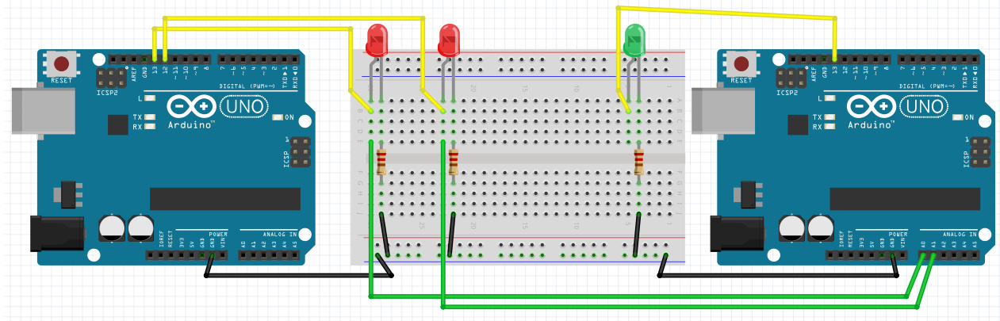
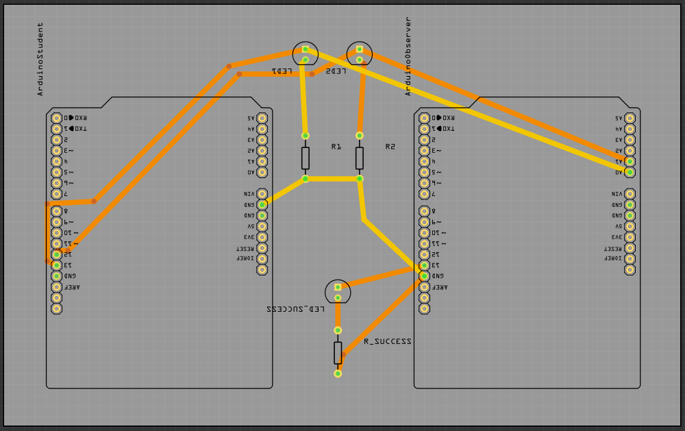

# LED Trial Shield, Yellow Belt

## Goal

Let the LEDs blink alternately, each LED being on for a second.

If this succeeds, the piezo will beep.

## Pins

 * The left rode LEDje is at pin 13
 * The right red LEDje is at pin 12

You cannot control the piezo.

## Extra information for supervisors

Etsen:

 * [LedTrialShieldYellowBelt_etch_copper_bottom_mirror.pdf](LedTrialShieldYellowBelt_etch_copper_bottom_mirror.pdf)
 * [LedTrialShieldYellowBelt_etch_copper_bottom.pdf](LedTrialShieldYellowBelt_etch_copper_bottom.pdf)
 * [LedTrialShieldYellowBelt_etch_copper_top_mirror.pdf](LedTrialShieldYellowBelt_etch_copper_top_mirror.pdf)
 * [LedTrialShieldYellowBelt_etch_copper_top.pdf](LedTrialShieldYellowBelt_etch_copper_top.pdf)
 * [LedTrialShieldYellowBelt_etch_mask_bottom_mirror.pdf](LedTrialShieldYellowBelt_etch_mask_bottom_mirror.pdf)
 * [LedTrialShieldYellowBelt_etch_mask_bottom.pdf](LedTrialShieldYellowBelt_etch_mask_bottom.pdf)
 * [LedTrialShieldYellowBelt_etch_mask_top_mirror.pdf](LedTrialShieldYellowBelt_etch_mask_top_mirror.pdf)
 * [LedTrialShieldYellowBelt_etch_mask_top.pdf](LedTrialShieldYellowBelt_etch_mask_top.pdf)
 * [LedTrialShieldYellowBelt_etch_paste_mask_bottom_mirror.pdf](LedTrialShieldYellowBelt_etch_paste_mask_bottom_mirror.pdf)
 * [LedTrialShieldYellowBelt_etch_paste_mask_bottom.pdf](LedTrialShieldYellowBelt_etch_paste_mask_bottom.pdf)
 * [LedTrialShieldYellowBelt_etch_paste_mask_top_mirror.pdf](LedTrialShieldYellowBelt_etch_paste_mask_top_mirror.pdf)
 * [LedTrialShieldYellowBelt_etch_paste_mask_top.pdf](LedTrialShieldYellowBelt_etch_paste_mask_top.pdf)
 * [LedTrialShieldYellowBelt_etch_silk_bottom_mirror.pdf](LedTrialShieldYellowBelt_etch_silk_bottom_mirror.pdf)
 * [LedTrialShieldYellowBelt_etch_silk_bottom.pdf](LedTrialShieldYellowBelt_etch_silk_bottom.pdf)
 * [LedTrialShieldYellowBelt_etch_silk_top_mirror.pdf](LedTrialShieldYellowBelt_etch_silk_top_mirror.pdf)
 * [LedTrialShieldYellowBelt_etch_silk_top.pdf](LedTrialShieldYellowBelt_etch_silk_top.pdf)

## Copyright

All code is licensed under GPL 3.0, see [licensie](LICENSE).

 * Code of LED Trial Shield, Yellow Belt, by Richel Bilderbeek
 * Code the solve the LED Trial Shield, Yellow Belt, by Richel Bilderbeek
 * Fritzing schematics by Richel Bilderbeek
