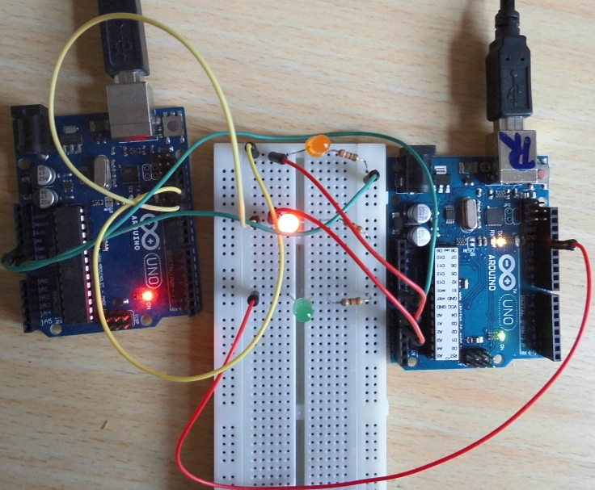
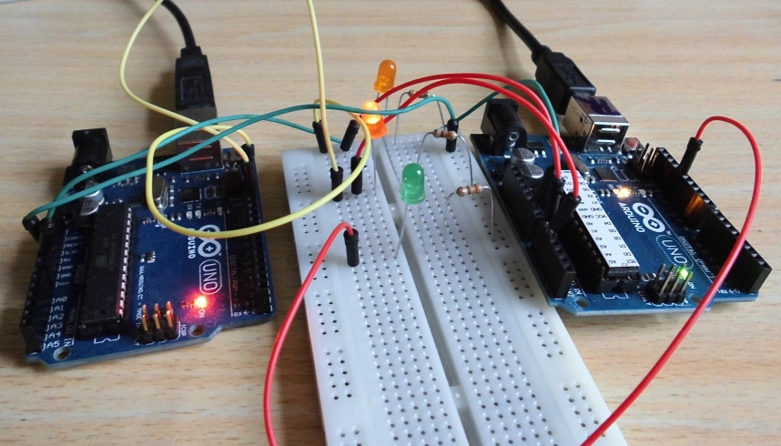
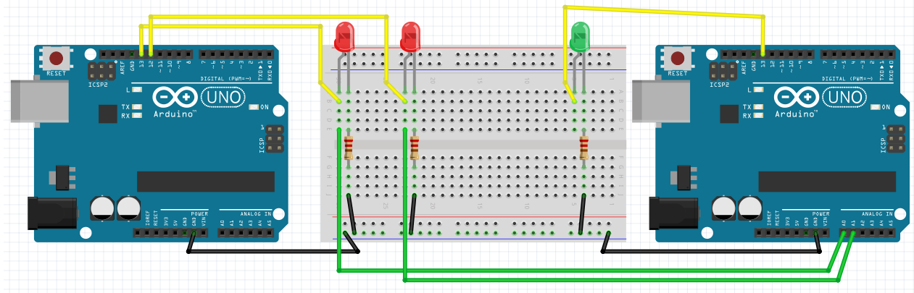
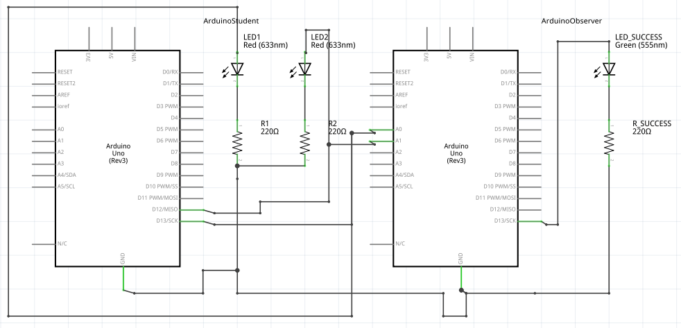
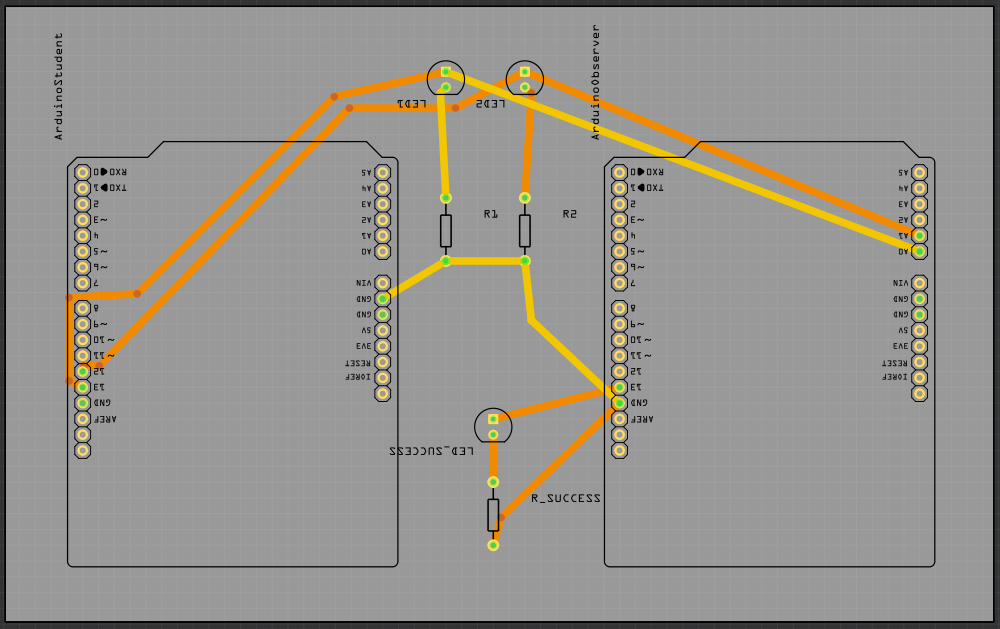

# LED Trial Shield, Gele Band

## Doel

De LEDjes om de seconde omstebeurt laten branden.

Als dit gelukt is, gaat de piezo piepen.

## Pinnnummers

 * Het linker rode LEDje zit op pin 13
 * Het rechter rode LEDje zit op pin 12

De piezo kun je niet aansturen.

## Extra informatie voor de begeleiders

Etsen:

 * [LedTrialShieldYellowBelt_etch_copper_bottom_mirror.pdf](LedTrialShieldYellowBelt_etch_copper_bottom_mirror.pdf)
 * [LedTrialShieldYellowBelt_etch_copper_bottom.pdf](LedTrialShieldYellowBelt_etch_copper_bottom.pdf)
 * [LedTrialShieldYellowBelt_etch_copper_top_mirror.pdf](LedTrialShieldYellowBelt_etch_copper_top_mirror.pdf)
 * [LedTrialShieldYellowBelt_etch_copper_top.pdf](LedTrialShieldYellowBelt_etch_copper_top.pdf)
 * [LedTrialShieldYellowBelt_etch_mask_bottom_mirror.pdf](LedTrialShieldYellowBelt_etch_mask_bottom_mirror.pdf)
 * [LedTrialShieldYellowBelt_etch_mask_bottom.pdf](LedTrialShieldYellowBelt_etch_mask_bottom.pdf)
 * [LedTrialShieldYellowBelt_etch_mask_top_mirror.pdf](LedTrialShieldYellowBelt_etch_mask_top_mirror.pdf)
 * [LedTrialShieldYellowBelt_etch_mask_top.pdf](LedTrialShieldYellowBelt_etch_mask_top.pdf)
 * [LedTrialShieldYellowBelt_etch_paste_mask_bottom_mirror.pdf](LedTrialShieldYellowBelt_etch_paste_mask_bottom_mirror.pdf)
 * [LedTrialShieldYellowBelt_etch_paste_mask_bottom.pdf](LedTrialShieldYellowBelt_etch_paste_mask_bottom.pdf)
 * [LedTrialShieldYellowBelt_etch_paste_mask_top_mirror.pdf](LedTrialShieldYellowBelt_etch_paste_mask_top_mirror.pdf)
 * [LedTrialShieldYellowBelt_etch_paste_mask_top.pdf](LedTrialShieldYellowBelt_etch_paste_mask_top.pdf)
 * [LedTrialShieldYellowBelt_etch_silk_bottom_mirror.pdf](LedTrialShieldYellowBelt_etch_silk_bottom_mirror.pdf)
 * [LedTrialShieldYellowBelt_etch_silk_bottom.pdf](LedTrialShieldYellowBelt_etch_silk_bottom.pdf)
 * [LedTrialShieldYellowBelt_etch_silk_top_mirror.pdf](LedTrialShieldYellowBelt_etch_silk_top_mirror.pdf)
 * [LedTrialShieldYellowBelt_etch_silk_top.pdf](LedTrialShieldYellowBelt_etch_silk_top.pdf)

## Copyright

Alle code valt onder de GPL 3.0 licensie, zie [licensie](LICENSE).

 * De code van de LED Trial Shield, gele band, is geschreven door Thijs van Beers en Richel Bilderbeek
 * De code om de LED Trial Shield, gele band, op te lossen, is geschreven door Thijs van Beers
 * Het Fritzing schema is gemaakt door Richel Bilderbeek
